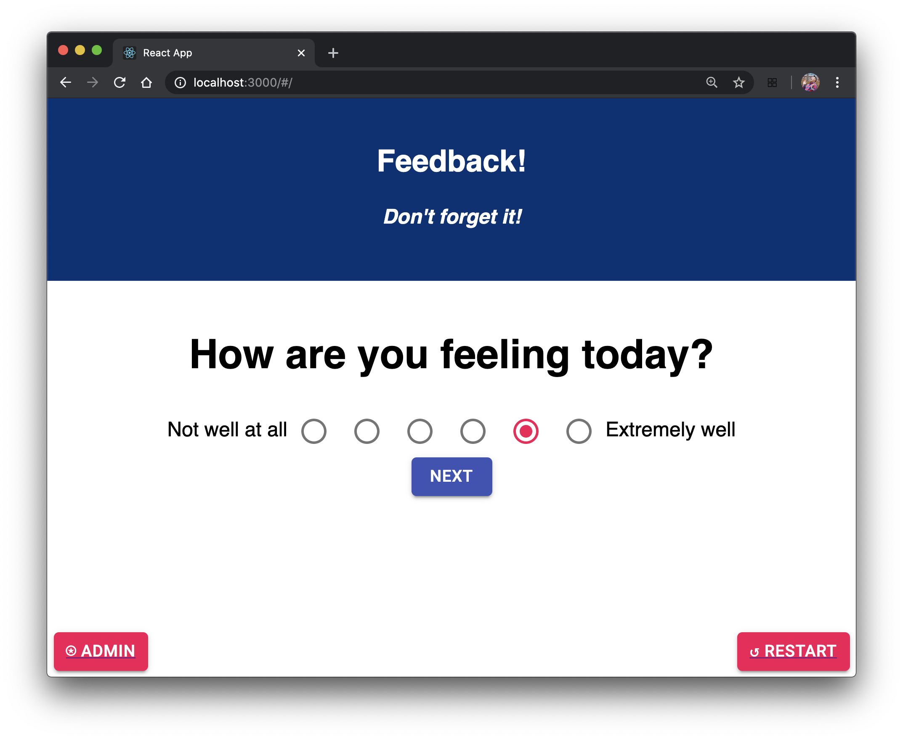
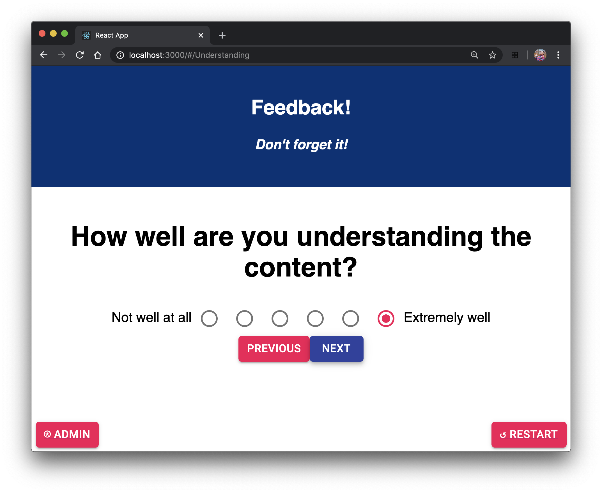
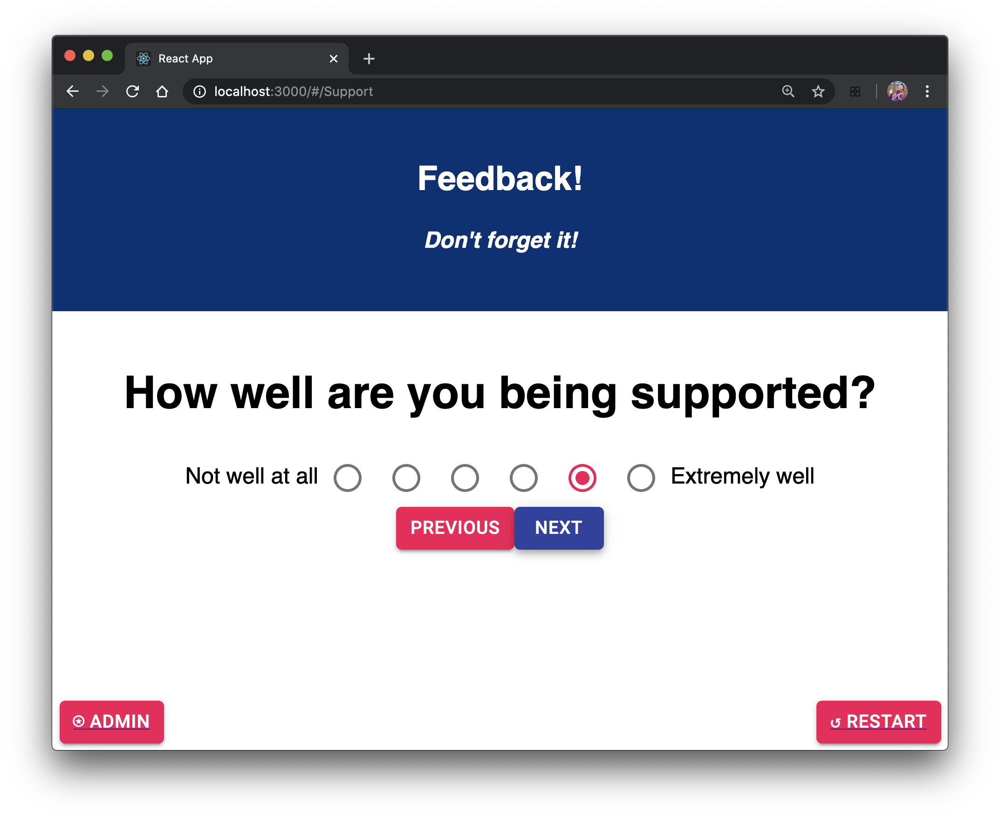
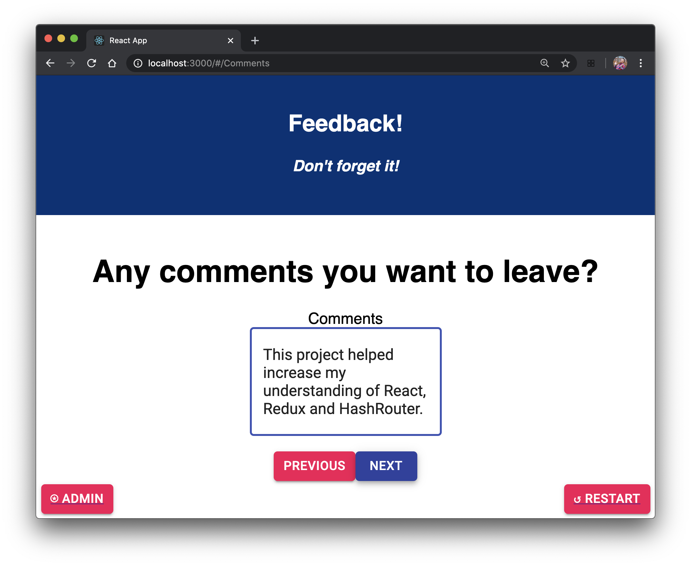
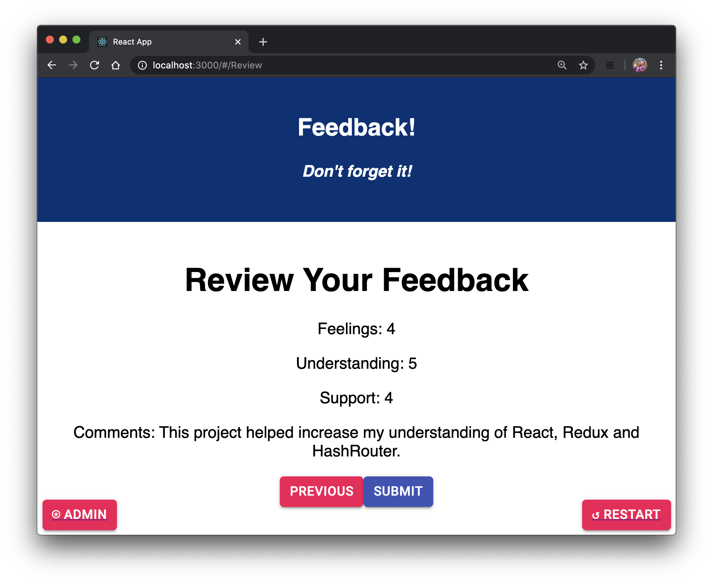
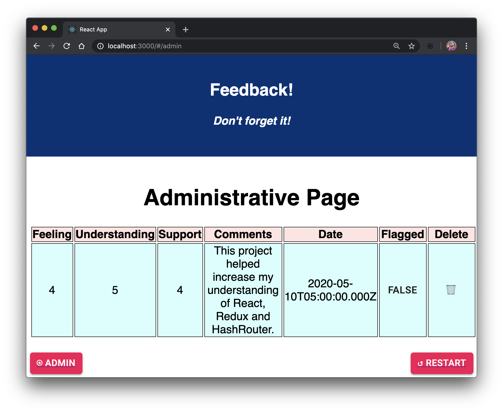

# REDUX FEEDBACK

Completed May 10th, 2020
by Tan Van Nguyen

## Technology utilized

    React.js, Redux, HashRouter, 
    Node, Express, Postgresql,
    Javascript, CSS, HTML, 
    Sweetalert2, Material-UI;

## Description

This weekend project required me to create a multi-part form that allows users to leave feedback.  Information is gathered using dispatches in Redux and redistributed among the other components.  Material UI and SweetAlert2 was utilized to improve the aesthetics of the application.  Axios requests allowed the page to work with the SQL database to store the feedback.  Administrators can flag or delete the feedback.

## Pictures of the Completed Project:

The Components:
- How are you feeling today?

- How well are you understanding the content?

- How well are you being supported?

- Any comments you want to leave?

- Review your feedback before submitting to database.

- Administrative view allows marking feedback as flagged or deleting them.
)

## Project Notes

By creating an outline and working on the skeleton first, I was able to visualize the finished project.  The project will be integral to my future in React and I believe it would be great to use as reference material.

Additional README details can be found [here](https://github.com/PrimeAcademy/readme-template/blob/master/README.md).